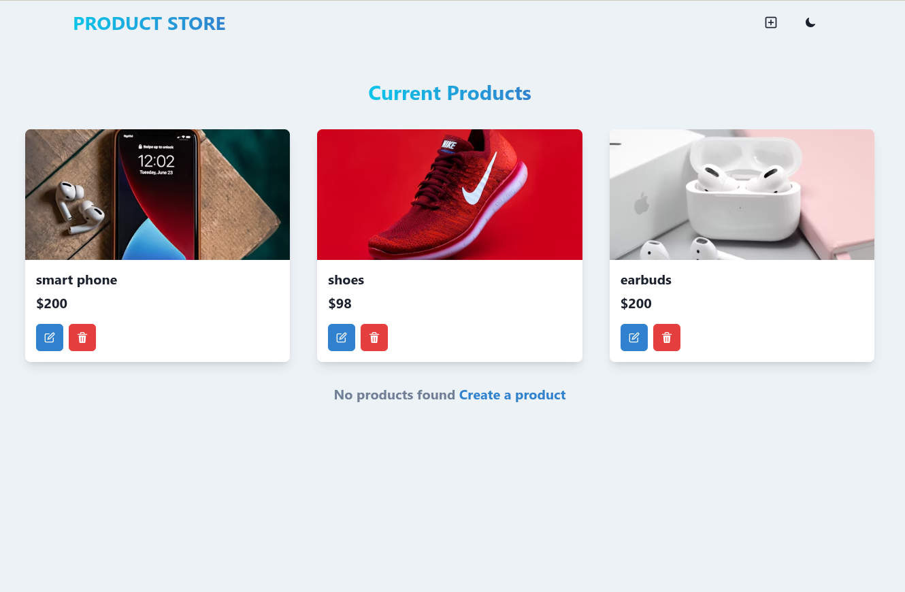

# MERN Crash Course

[](LICENSE)
[](https://mern-crash-course-8rqv.onrender.com/)

A full-stack web application built with the MERN stack (MongoDB, Express, React, Node.js). This project demonstrates CRUD operations, RESTful API integration, and responsive UI using Chakra UI.

---

## Features

- Modern MERN stack architecture
- Product management (Create, Read, Update, Delete)
- RESTful API with Express & MongoDB
- Responsive and accessible UI with Chakra UI
- State management with Zustand
- Deployed and production-ready

---

## Getting Started

### Prerequisites

- [Node.js](https://nodejs.org/) (v16+ recommended)
- [MongoDB](https://www.mongodb.com/) instance (local or cloud)

### Installation

1. **Clone the repository**
   ```bash
   git clone <repository-url>
   cd mern-crash-course
   ```

2. **Install dependencies**
   ```bash
   npm install
   ```

3. **Set up environment variables**

   Create a `.env` file in the root directory and add your MongoDB URI:
   ```
   MONGO_URI=your_mongodb_connection_string
   ```

4. **Run the application**

   - **Development mode**
     ```bash
     npm run dev
     ```
   - **Production build**
     ```bash
     npm run build
     npm start
     ```

5. **Access the app**

   - Local: [http://localhost:3000](http://localhost:3000)
   - API: [http://localhost:5000/api/products](http://localhost:5000/api/products)

---

## Live Demo

[🌐 View the deployed application](https://mern-crash-course-8rqv.onrender.com/)

---

## Screenshot



---

## Project Structure

```
mern-crash-course/
├── backend/      # Express API & MongoDB models
├── frontend/     # React client (Vite + Chakra UI)
├── .env          # Environment variables
├── package.json  # Project scripts & dependencies
└── README.md
```

---

## License

This project is licensed under the [MIT License](LICENSE).

---

> 
